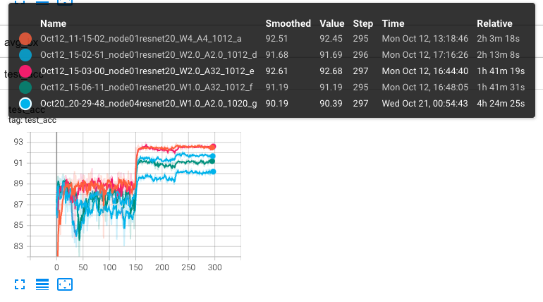
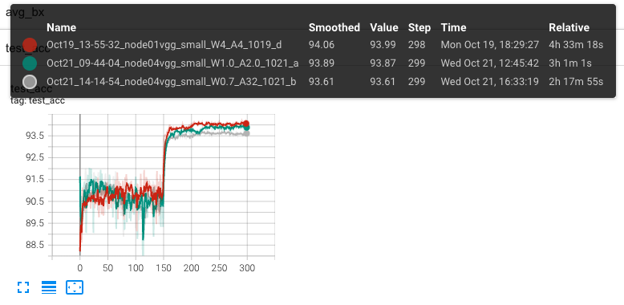
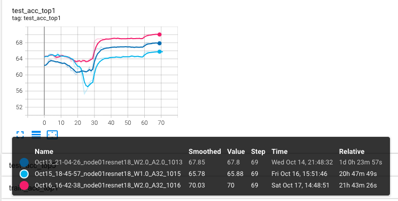

# DAMBQ

Pytorch implementation of CVPR2021 paper ["Distribution-aware Adaptive Multi-bit Quantization"](https://openaccess.thecvf.com/content/CVPR2021/papers/Zhao_Distribution-Aware_Adaptive_Multi-Bit_Quantization_CVPR_2021_paper.pdf)

## Note

This code is the main source for the experiments in the paper. However, it is not elegant enough and hard to extend to other project. Therefore, we reconstruct this repo with plug-and-play manner, please refer to DAMBQV2.

## Usage

**Train resnet20 on CIFAR10 Dataset from pretrained W32A32 to W4A4**

```
python CIFAR10/main.py --wd 1e-4 --lr 5e-2 -id 0 --bit_W_init 4 --bit_A_init 4 --init [resnet20_W32A32_model_path] --comment resnet20_W4_A4
```

## Result

**ResNet20 on CIFAR10**


**VGG small on CIFAR10**


**ResNet18 on ILSVRC12**


## Cite

If this repo or paper is helpful, please cite,

```
@inproceedings{zhao2021distribution,
  title={Distribution-aware adaptive multi-bit quantization},
  author={Zhao, Sijie and Yue, Tao and Hu, Xuemei},
  booktitle={Proceedings of the IEEE/CVF Conference on Computer Vision and Pattern Recognition},
  pages={9281--9290},
  year={2021}
}
```
